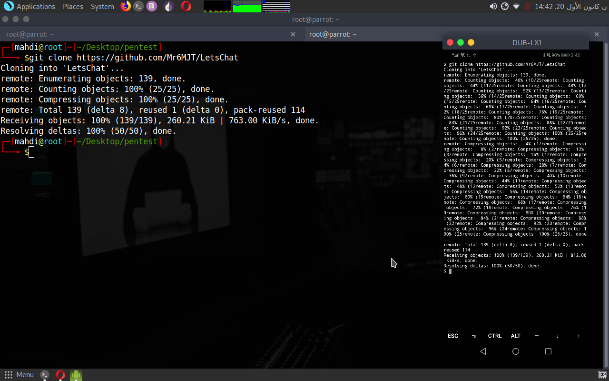
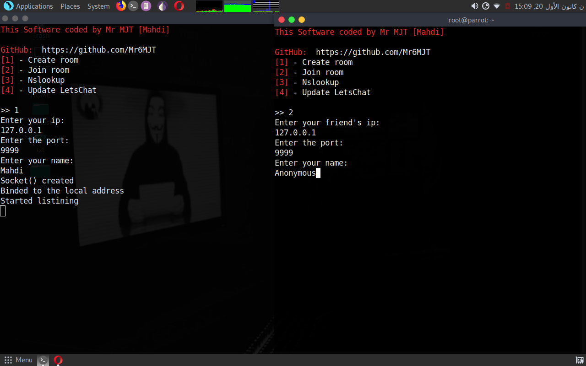

# HodHod
HodHod->Linux Chatting software,works on all linux distros,New update: File transfer.

Cloning it:
-------------

git clone https://github.com/Mr6MJT/HodHod

          

-------------
How to use it ?
--------------

1- bash chat

2- create chatting room or enter chatting room

if (you are the room creator) {

    cout << "Give your ip and the port number for your friend to enter the chat room\n";

}

else if (you are the room joiner) {

    cout << "Tell your friend <the room creator> to give you her ip and the port number\n";
    cout << "Then enter your friend's ip and the port number\n";

}

else {

  while (1) {
  
    
    cout << "hello world :) \n";
   
   }

}

 

